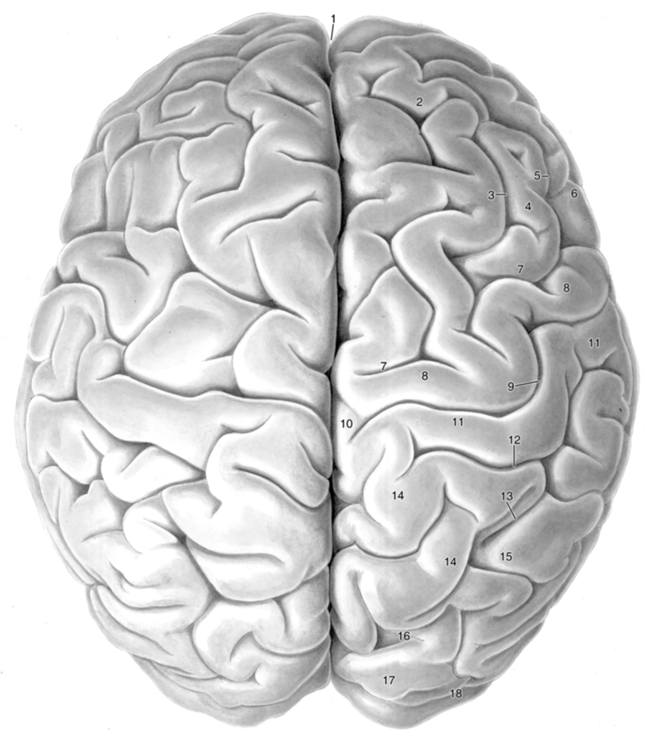
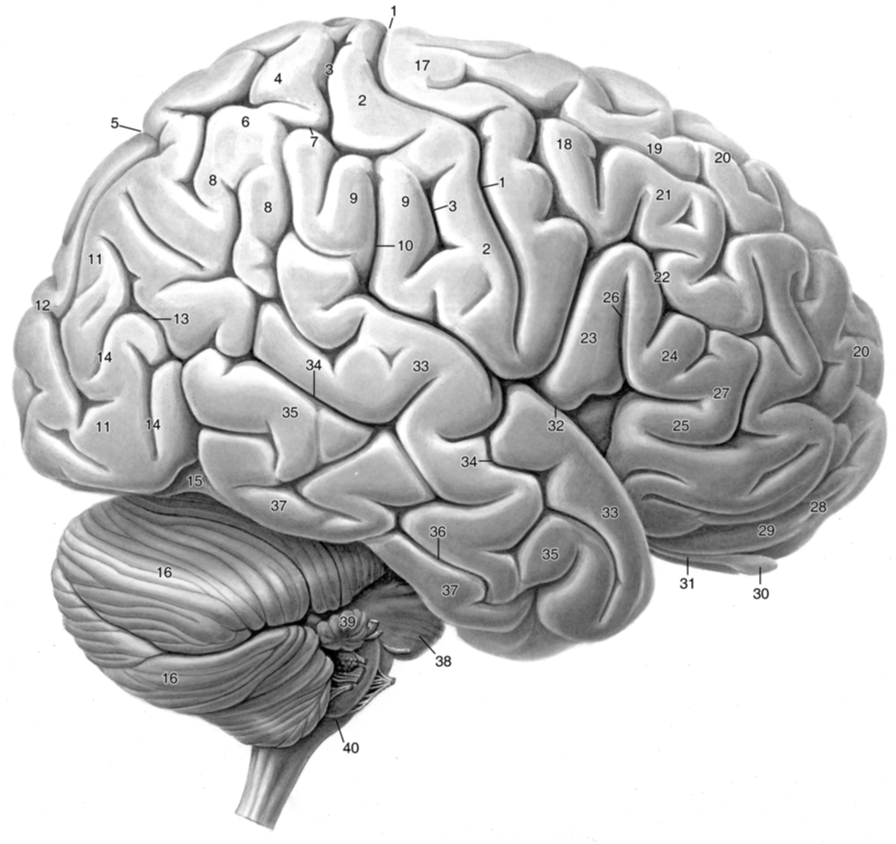

# Telencephalon
  
 1. Fissura longitudinalis cerebri 
 2. Gyrus frontalis superior
 3. Sulcus frontalis superior
 4. Gyrus frontalis medius
 5. Sulcus frontalis inferior
 6. Gyrus frontalis inferior
 7. Sulcus precentralis
 8. Gyrus precentralis
 9. Sulcus centralis - Rolando
 10. Lobulus paracentralis 
	 - Gyrus paracentralis anterior (Lobus frontalis)
	 - Gyrus paracentralis posterior (Lobus parietalis)
11. Gyrus postcentralis
12. Sulcus postcentralis
13. Sulcus intraparietalis
	- Sulcus intermedius primus - Jensen
	- Sulcus intermedius secundus - Eberstaller
14. Lobus parietalis superior
15. Lobus parietalis inferior
16. Sulcus parietooccipitalis - Sulcus of Gratiolet
17. Gyrus occipitalis superior
18. Sulcus occipitalis transversus

 ---

1. Sulcus Centralis - Rolando
2. Gyrus postcentralis 
3. Sulcus postcentralis
4. Lobus parietalis superior
5. Sulcus parieto-occipitalis - Sulcus of Gratiolet
6. Lobus parietalis inferior
	8. Gyrus angularis Ba39
	9. Gyrus supramarginalis  Ba40
7. Sulcus intraparietalis
	- Sulcus intermedius primus - Jensen
	- Sulcus intermedius secundus - Eberstaller
10. Sulcus lateralis - Sylvius, Ramus posterior
11. Gyrii occipitales
12. Sulcus lunatus
13. 
---
  ## Morphologia externa
  ### Hemispherium cerebri
  1. Gyri cerebri
  2. Lobi cerebri
  3. Sulci cerebri
  4. Fissura longitudinalis cerebri
  5. Fossa lateralis cerebri
  6. Margo superior
  7. Margo inferiomedialis
  8. Margo inferiolateralis